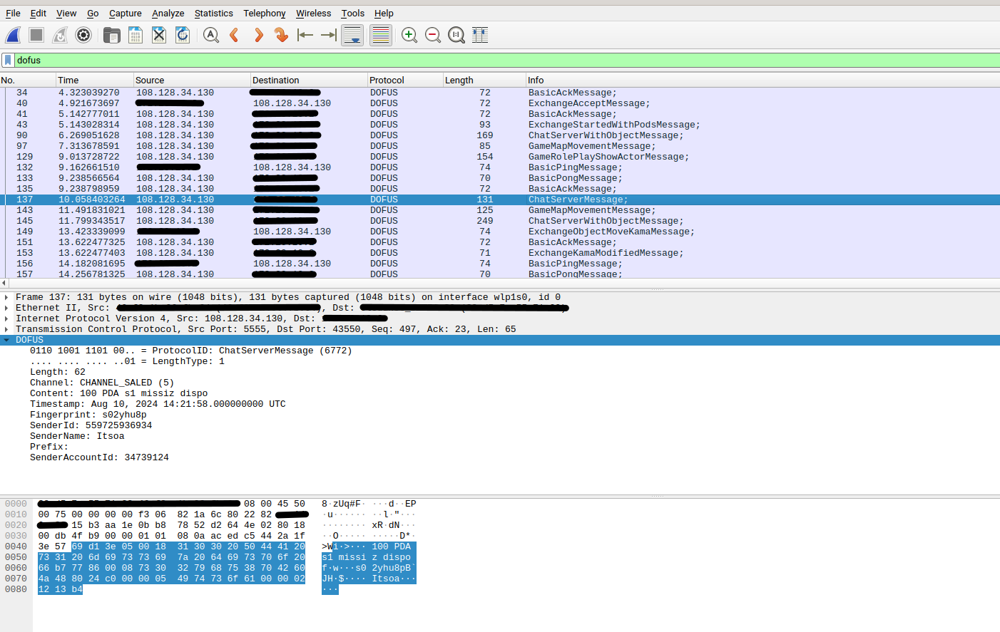
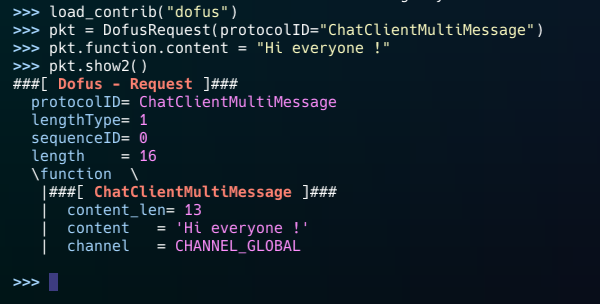

# D2Parsers

This repo contains a Wireshark and Scapy dissector for Dofus 2 protocol.

Dissectors support TCP fragmentation.

For the moment, they are incomplete, but will be updated frequently.

## How to install

To download the repo do :

```bash
git clone https://github.com/lk740/D2Parsers.git
```

### Wireshark dissector

To add `dofus.lua` to Wireshark, you need to copy the file into the `epan` folder of Wireshark.

_Windows_ : `C:/Program Files/Wireshark/plugins/4.X/epan/`

_Linux_ : `/usr/lib/x86_64-linux-gnu/wireshark/plugins/4.X/epan/`

After that, start Wireshark and enjoy !

### Scapy dissector

To add `dofus.py` to Scapy, you need to copy `protocol_scapy.json` and `dofus.py` into the `contrib` folder of Scapy.

The path depends of you installation.

After that, you can use the dissector in Scapy by typing :

```python 
>>> load_contrib("dofus")
```

Or import it directly in your script :

```python
from scapy.contrib.dofus import *
```

## Getting Started

Wireshark filter to display Dofus packets : `dofus`



Basic creation of a Dofus packet :




## Disclaimer

These tools are for educational use only. I am in no way responsible for the use you make of them. 

## Contributing

This project is currently under development. I am open to any improvements or advice.

